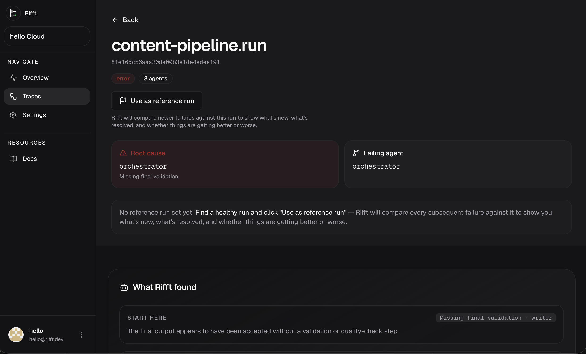

# Rifft

Rifft — cross-framework debugger for multi-agent AI systems.

[](https://www.npmjs.com/package/@rifft-dev/rifft)
[](https://pypi.org/project/rifft-sdk/)
[](https://github.com/rifft-dev/rifft/blob/main/LICENSE)
[](https://github.com/rifft-dev/rifft)

Rifft helps developers debug multi-agent AI systems by making agent decisions, message flow, tool calls, and failure cascades visible across frameworks. It is intentionally opinionated: Rifft is for debugging multi-agent behavior, not for generic LLM observability.

JavaScript SDK:

```bash
npm install @rifft-dev/rifft
```

Python SDK:

```bash
pip install rifft-sdk
```

Python adapters:

- CrewAI: [`rifft-crewai`](https://pypi.org/project/rifft-crewai/)
- AutoGen: [`rifft-autogen`](https://pypi.org/project/rifft-autogen/)
- MCP: [`rifft-mcp`](https://pypi.org/project/rifft-mcp/)

## Screenshot



## What Rifft does

- Cross-framework trace ingestion for multi-agent runs
- Agent-to-agent graph visualization
- Timeline and per-agent debugging views
- MAST failure classification
- Self-hosted deployment with Docker Compose

## What Rifft does not do

- Prompt management UI
- LLM evaluation or scoring
- AI gateway or proxy features
- General APM or application monitoring
- Single-LLM call tracing as the primary feature

## Framework support

| Framework | Status |
| --- | --- |
| CrewAI | Full |
| AutoGen / AG2 | Full |
| MCP | Full |
| LangGraph | Planned |
| Custom agents via SDK | Full |

## 5-minute CrewAI quickstart

```python
pip install rifft-sdk rifft-crewai
```

```python
import rifft
import rifft.adapters.crewai

rifft.init(project_id="my-project", endpoint="http://localhost:4318")

# Your existing crew code unchanged
crew = Crew(agents=[...], tasks=[...])
result = crew.kickoff()
# Open http://localhost:3000 to see the trace
```

Other Python installs:

```bash
pip install rifft-sdk rifft-autogen
pip install rifft-sdk rifft-mcp
```

## Self-host in under 5 minutes

```bash
git clone https://github.com/rifft-dev/rifft.git
cd rifft
docker compose up -d --build
open http://localhost:3000
```

Default local endpoints:

- Web UI: `http://localhost:3000`
- API: `http://localhost:4000`
- Collector HTTP: `http://localhost:4318`
- Collector gRPC: `localhost:4317`

## Monorepo layout

```text
rifft/
├── apps/
│   ├── api
│   ├── site
│   └── web
├── infra/
│   └── docker
├── packages/
│   ├── adapters/
│   │   ├── autogen
│   │   ├── crewai
│   │   └── mcp
│   ├── collector
│   ├── sdk-js
│   └── sdk-python
└── docs/
```

## Developer notes

- Current implementation tracker: [docs/implementation-tracker.md](/Users/ned/Documents/GitHub/Rifft/docs/implementation-tracker.md)
- Current Phase 0/1 plan: [docs/phase-0-1-plan.md](/Users/ned/Documents/GitHub/Rifft/docs/phase-0-1-plan.md)
- Exceptional product roadmap: [docs/exceptional-roadmap.md](/Users/ned/Documents/GitHub/Rifft/docs/exceptional-roadmap.md)
- Use [scripts/cleanup-demo-traces.sh](/Users/ned/Documents/GitHub/Rifft/scripts/cleanup-demo-traces.sh) to remove stale pre-fix demo traces from local storage.

## Docs

- Architecture notes: [docs/architecture.md](/Users/ned/Documents/GitHub/Rifft/docs/architecture.md)
- Cloud MVP spec: [docs/cloud-mvp.md](/Users/ned/Documents/GitHub/Rifft/docs/cloud-mvp.md)
- Deployment checklist: [docs/deployment-checklist.md](/Users/ned/Documents/GitHub/Rifft/docs/deployment-checklist.md)
- Docs/wiki placeholder: [GitHub Wiki](https://github.com/rifft-dev/rifft/wiki)
- Contributing: [CONTRIBUTING.md](/Users/ned/Documents/GitHub/Rifft/CONTRIBUTING.md)
- Marketing landing page: [apps/web/app/page.tsx](/Users/ned/Documents/GitHub/Rifft/apps/web/app/page.tsx)

## Cloud billing env

To enable the in-app Pro upgrade CTA after the first trace lands, set:

```bash
POLAR_ACCESS_TOKEN=...
POLAR_PRO_PRODUCT_ID=...
```

The web app creates a Polar checkout session server-side and passes the Rifft `account_id` as `external_customer_id`, so the webhook can map the subscription back to the correct cloud account deterministically.

To sync paid plan state back into Rifft Cloud, point Polar webhooks at:

```bash
POST /webhooks/polar
```

and set:

```bash
POLAR_WEBHOOK_SECRET=...
```

The API uses this webhook to store subscription state, switch Cloud Free vs Cloud Pro in settings, and keep project retention aligned with the paid plan.

For paid users, the settings page also opens the Polar customer portal through a server-side customer session using the same `external_customer_id`, so subscription management stays deterministic too.

## License

MIT
