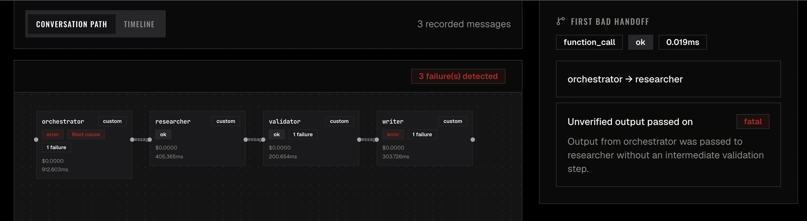

# Rifft

Rifft finds the handoff that broke your multi-agent run — not just the error message. It walks backwards through spans to the root cause, classifies the failure with the UC Berkeley MAST taxonomy, and shows you the exact agent and message where things went wrong.



[](https://www.npmjs.com/package/@rifft-dev/rifft)
[](https://pypi.org/project/rifft-sdk/)
[](https://github.com/rifft-dev/rifft/blob/main/LICENSE)
[](https://github.com/rifft-dev/rifft)

## Install

JavaScript SDK:

```bash
npm install @rifft-dev/rifft
```

Python SDK:

```bash
pip install rifft-sdk
```

Python adapters:

- CrewAI: [`rifft-crewai`](https://pypi.org/project/rifft-crewai/)
- AutoGen / AG2: [`rifft-autogen`](https://pypi.org/project/rifft-autogen/)
- MCP: [`rifft-mcp`](https://pypi.org/project/rifft-mcp/)

**Claude Code** — trace every session with zero code changes:

```bash
rifft-claude init --project-id YOUR_PROJECT_ID --api-key YOUR_API_KEY
```

## Why not Langfuse or LangSmith?

Langfuse and LangSmith are excellent general-purpose LLM observability platforms. Rifft is different in one specific way: it is built for multi-agent failure analysis, not span collection.

- **Root cause, not span trees.** When a 4-agent run fails, Langfuse shows you a tree of 200 spans. Rifft shows you which agent caused the failure and why, in plain English.
- **MAST classification.** Every failure is automatically classified against the UC Berkeley MAST taxonomy — 15 standardised failure modes covering tool call hallucinations, dropped handoffs, and context overflows. You get a label, an explanation, and a suggested fix.
- **Agent graph, not a waterfall.** Rifft renders the agent communication graph so you can see which agent sent what to which, where messages were dropped, and which handoff edge was the bad one.
- **Not for single-LLM tracing.** If you're tracing individual LLM calls in a monolithic app, use Langfuse or Helicone. Rifft is opinionated: it is for multi-agent systems where the failure could be anywhere in the chain.

## What Rifft does

- Cross-framework trace ingestion over OTLP
- Agent-to-agent communication graph
- MAST failure classification with fix suggestions
- Causal attribution — root cause agent, failing agent
- Timeline and per-agent debugging views
- Dataset and eval workflow for regression testing
- Self-hosted (Docker Compose) and cloud (rifft.dev)

## What Rifft does not do

- Prompt management UI
- LLM evaluation or scoring
- AI gateway or proxy features
- General APM or application monitoring
- Single-LLM call tracing as the primary use case

## Framework support

| Framework | Status |
| --- | --- |
| CrewAI | Full |
| AutoGen / AG2 | Full |
| MCP | Full |
| Claude Code | Full (via `rifft-claude`) |
| Custom agents via SDK | Full |
| LangGraph | Planned |

## 5-minute CrewAI quickstart

```bash
pip install rifft-sdk rifft-crewai
```

```python
import rifft
import rifft.adapters.crewai

rifft.init(project_id="my-project", endpoint="http://localhost:4318")

# Your existing crew code unchanged
crew = Crew(agents=[...], tasks=[...])
result = crew.kickoff()
# Open http://localhost:3000 to see the trace
```

Other Python installs:

```bash
pip install rifft-sdk rifft-autogen
pip install rifft-sdk rifft-mcp
```

## Self-host in under 5 minutes

```bash
git clone https://github.com/rifft-dev/rifft.git
cd rifft
docker compose up -d --build
open http://localhost:3000
```

Default local endpoints:

- Web UI: `http://localhost:3000`
- API: `http://localhost:4000`
- Collector HTTP: `http://localhost:4318`
- Collector gRPC: `localhost:4317`

## Monorepo layout

```text
rifft/
├── apps/
│   ├── api
│   ├── site
│   └── web
├── infra/
│   └── docker
├── packages/
│   ├── adapters/
│   │   ├── autogen
│   │   ├── crewai
│   │   └── mcp
│   ├── collector
│   ├── sdk-js
│   └── sdk-python
└── docs/
```

## Community

Ask questions, share broken multi-agent traces, and follow updates in [GitHub Discussions](https://github.com/rifft-dev/rifft/discussions).

## License

MIT
